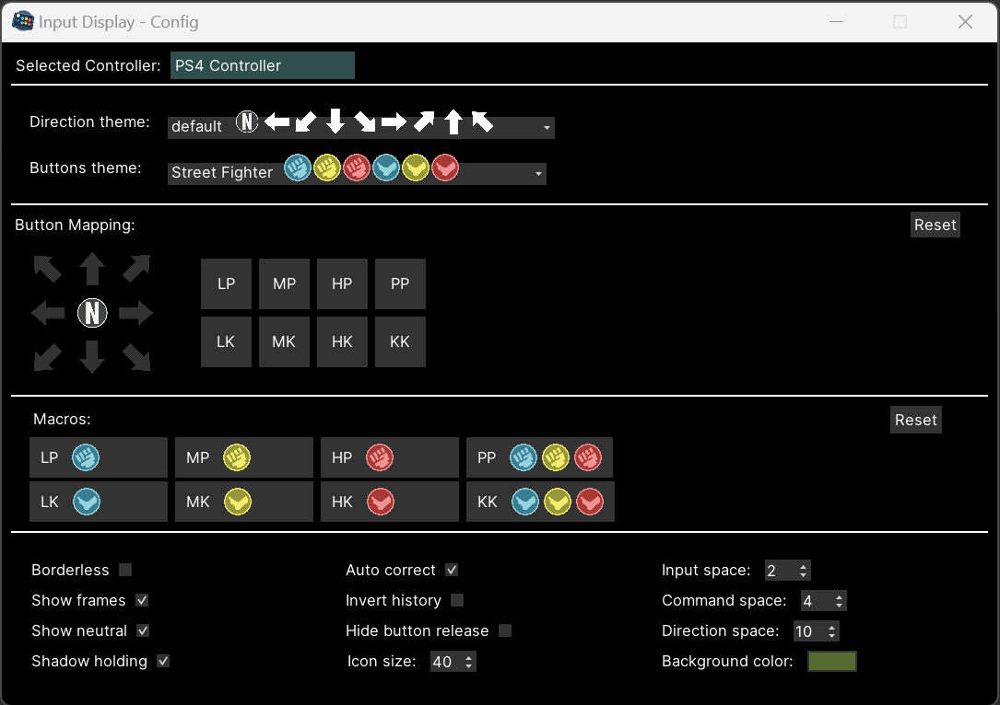
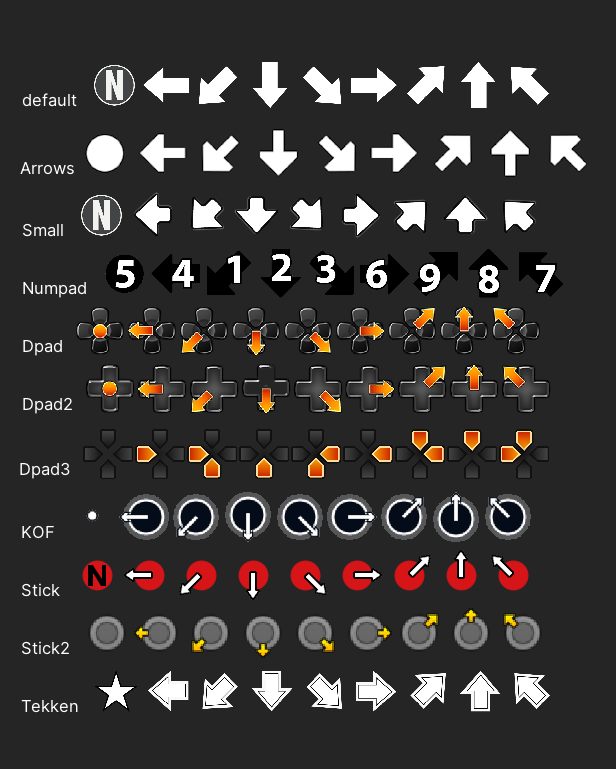
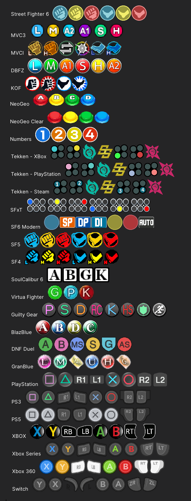

# 🕹️ Input Display

Display your gamepad inputs in a fighting game training mode style! ⬇️↘️➡️+👊

It is amazing to be used as a streaming
widget ([see here](https://github.com/lucasteles/InputDisplay/blob/master/how_to_obs.md)) or any video content.

💡 **Oficial successor** of [FGInputLogger](https://github.com/lucasteles/FGInputLogger)

## Download

Download the latest version 👉 [**HERE**](https://github.com/lucasteles/InputDisplay/releases) 👈

## ⌨️ Shortcuts:

> [!IMPORTANT]
> Some shortcuts are disabled if you are in **Keyboard** mode

- ️**Double Click** / **F1**: Open configuration window
- ️**ESC**: Disconnect/Exit
- ⬇️/⬆️: Change directions theme
- ⬅️/➡️: Change buttons theme
- **Mouse Scroll**: Zoom In / Zoom Out
- ️**B**: Toggle window border
- ️**BACK**: Clear window
- ️**DEL** : Disconnect controller
- ️**I**: Invert input order

## 🎥 Setting up [OBS Studio](https://obsproject.com)

## ⚙️ Configuration:

You can configure the layout, themes, and mapping by running the `config.cmd`, pressing **F1**, or double-clicking on the window

[How to configure Input Display on OBS Studio](https://github.com/lucasteles/InputDisplay/blob/master/how_to_obs.md)

## 📷 Screenshots

## 📷 Themes

- ### Directions
  

- ### Buttons
  

License
=======
InputDisplay is licensed under the [GPL-3.0 license](LICENSE.txt).
