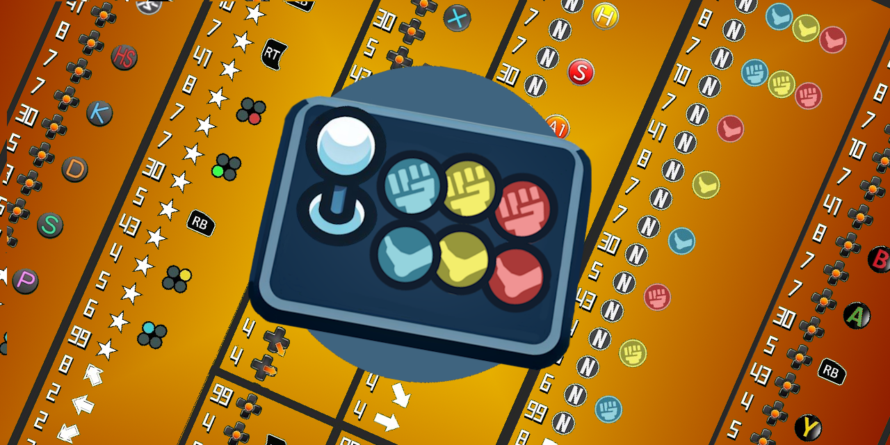
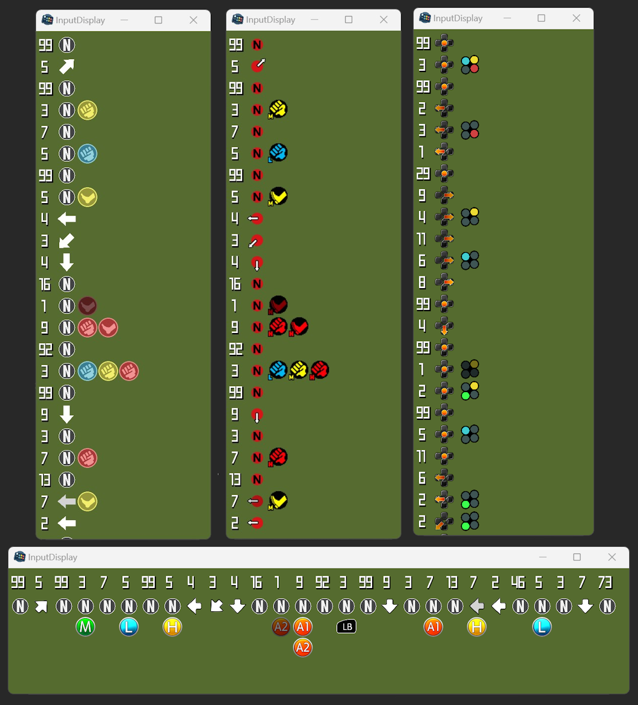
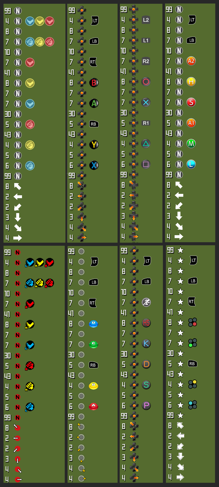

# 🕹️ Input Display



Display your gamepad inputs in a fighting game training mode style! ⬇️↘️➡️+👊

It is amazing to be used as a streaming
widget ([see here](https://github.com/lucasteles/InputDisplay/blob/master/how_to_obs.md)) or any video content.

💡 **Oficial successor** of [FGInputLogger](https://github.com/lucasteles/FGInputLogger)

> **⚠️:** _this project is beta, it is missing some configuration features for now_

## Download

Download the latest version 👉 [**HERE**](https://github.com/lucasteles/InputDisplay/releases) 👈

## ⌨️ Shortcuts:

- ⬇️/⬆️: Change directions theme
- ⬅️/➡️: Change buttons theme
- **Mouse Scroll**: Zoom In / Zoom Out
- ️**Double Click**: Toggle window border
- ️**BACK**: Clear window
- ️**DEL** : Disconnect controller
- ️**I**: Invert order
- ️**ESC**: Exit

## 🎥 Setting up [OBS Studio](https://obsproject.com)

## ⚙️ Configuration:

You need first to open the `exe` and press any button on the controller. You should be able to see your inputs.

After this. a file called `config.json` should be updated with your controller information,
you can change mappings and parameters in this file.

You can also change the `macro` key to set-up multiple images on a single input.

Example:
> setting `LB/L1` to show symbols for `HP`+`HK`

```
{
    ...
    "macros": {
        "PP": [ "HP", "HK" ]
    }
    ...
}
```

[How to configure Input Display on OBS Studio](https://github.com/lucasteles/InputDisplay/blob/master/how_to_obs.md)

## 📷 Screenshots




License
=======
InputDisplay is licensed under the [GPL-3.0 license](LICENSE.txt).
